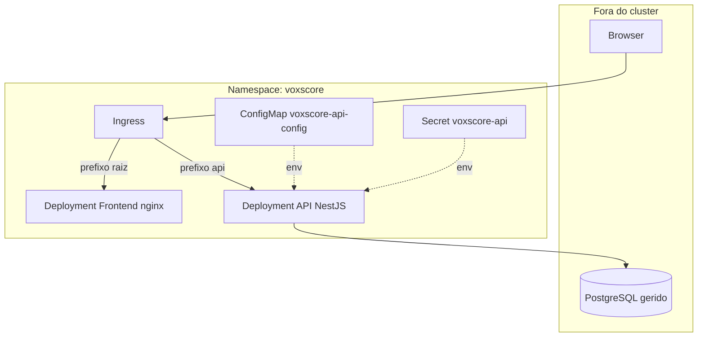
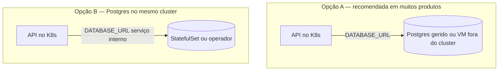
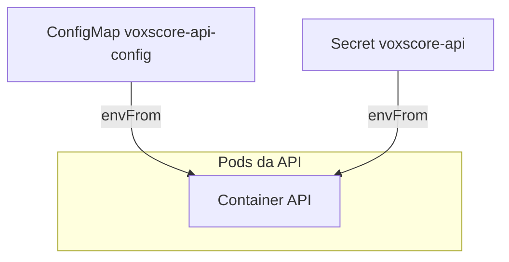
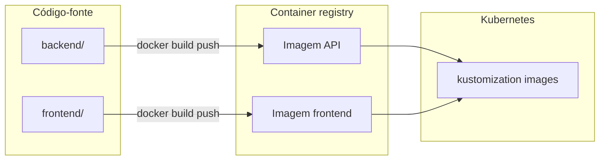
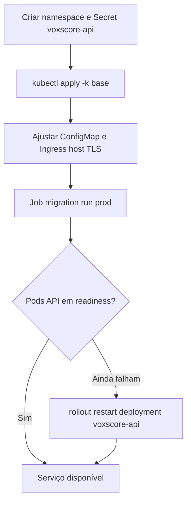
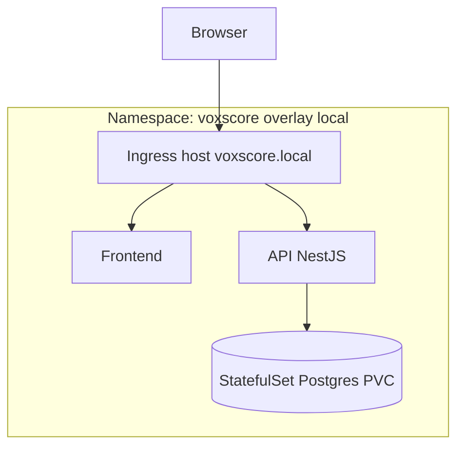
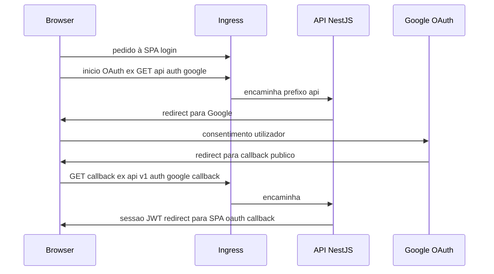

# VoxScore — Implantação em Kubernetes

Este documento alinha **backend** (NestJS) e **frontend** (SPA Vite/React) ao ambiente de referência descrito no [DEVSPEC.md](../../DEVSPEC.md) (secção 5.1). O repositório inclui **Dockerfiles**, **Kustomize** em [`base/`](./base/), overlay [`overlays/with-postgres/`](./overlays/with-postgres/) (PostgreSQL no cluster + stack alinhada ao `base`) e overlay [`overlays/local/`](./overlays/local/) (demo com OAuth mock e Ingress `voxscore.local`).

## Visão geral

| Componente | Papel no cluster |
|------------|------------------|
| **API** | `Deployment` + `Service`; tráfego externo via **Ingress** (ou API Gateway) com TLS. |
| **Frontend** | Ficheiros estáticos do `npm run build` em **nginx**; `Deployment` + `Service` + **Ingress**. |
| **PostgreSQL** | Recomendado em produção: base **gerida** (RDS, AlloyDB, Azure Database, etc.) referenciada por `DATABASE_URL` num **Secret**. O overlay `local` inclui um **StatefulSet** só para testes em cluster. |

### Arquitetura lógica no cluster (base + Postgres externo)

O tráfego entra pelo **Ingress** no mesmo hostname público: o prefixo de URL decide se o pedido vai para a SPA (ficheiros estáticos) ou para a API. A API lê configuração não sensível do **ConfigMap** e credenciais do **Secret**; fala com o Postgres fora do cluster.



## PostgreSQL — onde corre e opções no Kubernetes

Na implantação **não há um único destino fixo** para o Postgres: o que o Kubernetes orquestra são a API e o frontend; a base de dados é apenas um **endpoint** referenciado por `DATABASE_URL` no Secret `voxscore-api`.

| Cenário | Onde está o PostgreSQL | O que este repositório já prevê |
|--------|-------------------------|----------------------------------|
| **Produção / staging típico** | **Fora** do cluster (serviço gerido ou Postgres noutro sítio) | Manifestos em [`base/`](./base/): só a API liga-se via rede ao host da URL. |
| **Postgres no mesmo cluster que a app** | **Dentro** do cluster | Overlay [`overlays/with-postgres/`](./overlays/with-postgres/): `StatefulSet` + PVC 10 Gi + `Service` `postgres`, Secrets gerados, initContainer na API; alinhado ao `base` (2 réplicas, `TYPEORM_MIGRATIONS_RUN=false`, Job de migrate). |
| **Desenvolvimento rápido (mock OAuth)** | **Dentro** do cluster | Overlay [`overlays/local/`](./overlays/local/): Postgres + credenciais fixas no manifesto, mock Google, 1 réplica, Ingress `voxscore.local`. |

**Sim, é possível** correr PostgreSQL no Kubernetes em ambientes reais, não só em demos. Formas habituais:

1. **StatefulSet + PVC** (overlays [`with-postgres`](./overlays/with-postgres/) ou [`local`](./overlays/local/)) — simples; a equipa fica responsável por backups, upgrades, HA e tuning.
2. **Operador** (por exemplo [CloudNativePG](https://cloudnative-pg.io/), Zalando Postgres Operator, Crunchy Data) — replicação, failover e backups mais estruturados.

Em produção muitas equipas preferem **base gerida** (RDS, Azure Database, Cloud SQL, etc.) para reduzir risco operacional; in-cluster exige o mesmo rigor que um servidor Postgres dedicado (persistência, backups testados, `NetworkPolicy`, segredos e plano de recuperação).



## Estrutura de ficheiros

| Caminho | Descrição |
|---------|-----------|
| [`backend/Dockerfile`](../../backend/Dockerfile) | Imagem multi-stage da API (`node dist/main.js`). |
| [`frontend/Dockerfile`](../../frontend/Dockerfile) | Build Vite + nginx com `try_files` para SPA. |
| [`base/`](./base/) | Namespace `voxscore`, ConfigMap da API, Deployments, Services, Ingress (host de exemplo). |
| [`base/job-migrate.yaml`](./base/job-migrate.yaml) | **Job** de migrações TypeORM — aplicar manualmente (não está no `kustomization` por defeito, para evitar conflitos em `kubectl apply` repetidos). |
| [`overlays/with-postgres/`](./overlays/with-postgres/) | Postgres in-cluster com Secrets (`postgres-credentials` + `voxscore-api`), PVC 10 Gi, initContainer na API; alinhado ao `base` (2 réplicas, migrações via Job). |
| [`overlays/local/`](./overlays/local/) | Postgres in-cluster para demo, secret de demonstração, `AUTH_GOOGLE_MOCK_ENABLED=true`, Ingress em `voxscore.local`. |

### Overlay `with-postgres` — PostgreSQL dentro do Kubernetes

Use quando quiser **PostgreSQL a correr no próprio cluster** (homologação ou ambiente sem base gerida), mantendo o modelo do `base`: **`TYPEORM_MIGRATIONS_RUN=false`**, **duas réplicas** da API e **Job** de migrações.

```bash
kubectl apply -k ./overlays/with-postgres
kubectl -n voxscore delete job voxscore-migrate --ignore-not-found
sed "s|voxscore/api:latest|SEU_REGISTRY/voxscore-api:TAG|g" ./base/job-migrate.yaml | kubectl -n voxscore apply -f -
kubectl -n voxscore wait --for=condition=complete job/voxscore-migrate --timeout=300s
kubectl -n voxscore rollout restart deployment/voxscore-api
```

Requisitos: **StorageClass** por defeito para o PVC do Postgres; imagens `voxscore/api` e `voxscore/frontend` acessíveis pelo cluster.

**Credenciais:** em [`overlays/with-postgres/kustomization.yaml`](./overlays/with-postgres/kustomization.yaml), o valor de `POSTGRES_PASSWORD` no Secret `postgres-credentials` tem de coincidir com a password na URL `DATABASE_URL` do Secret `voxscore-api`. Se a password tiver caracteres reservados na URL, use [encoding na connection string](https://www.postgresql.org/docs/current/libpq-connect.html#LIBPQ-CONNSTRING).

Ajuste **ConfigMap** `voxscore-api-config` (`CORS_ORIGINS`), **Ingress** (host, TLS) e literais OAuth/Google no `secretGenerator` (ou migre para Sealed Secrets / External Secrets).

## Variáveis e segredos

| Chave (exemplo) | Onde | Notas |
|-----------------|------|--------|
| `DATABASE_URL` | **Secret** `voxscore-api` | URL PostgreSQL; nunca no Git. |
| `TYPEORM_MIGRATIONS_RUN` | **ConfigMap** `voxscore-api-config` | **`false`** com várias réplicas + **Job** de migrate (`base` e `with-postgres`); overlay `local` usa `true` e 1 réplica. |
| `JWT_SECRET`, OAuth Google | **Secret** `voxscore-api` | Ver [`backend/.env.example`](../../backend/.env.example). |
| `CORS_ORIGINS` | **ConfigMap** | Origem exata do browser (URL do Ingress). |
| `THROTTLE_*` (opcional) | **ConfigMap** | Ver `backend/.env.example`. |
| `VITE_*` | **Build** do frontend | Opcional: com o mesmo host no Ingress, pode omitir `VITE_API_BASE_URL` e usar caminhos relativos `/api/v1`. |

### Injeção de configuração nos Pods da API



## Deploy inicial — frontend, backend e PostgreSQL no cluster

Use quando tiver um cluster Kubernetes e quiser a **primeira instalação** da aplicação com **base de dados incluída** no próprio cluster. O caminho recomendado é o overlay **[`overlays/with-postgres/`](./overlays/with-postgres/)** (API + frontend do `base` + Postgres com PVC).

### Pré-requisitos

- `kubectl` apontando para o cluster.
- **StorageClass** por defeito (para o PVC do Postgres).
- **Ingress** (ex.: NGINX) se quiser aceder à app por hostname; sem Ingress pode usar `kubectl port-forward` aos Services.
- Imagens da API e do frontend **acessíveis pelo cluster** (registry com pull permitido ou imagens pré-carregadas).

### Sequência de comandos (primeira vez)

Trabalhe a partir do diretório `deploy/kubernetes`. Substitua `SEU_REGISTRY`, `TAG` e os URLs de OAuth pelo vosso ambiente.

```bash
cd deploy/kubernetes

# 1) Imagens
docker build -t SEU_REGISTRY/voxscore-api:TAG ../../backend
docker build -t SEU_REGISTRY/voxscore-frontend:TAG ../../frontend
docker push SEU_REGISTRY/voxscore-api:TAG
docker push SEU_REGISTRY/voxscore-frontend:TAG
```

Edite [`overlays/with-postgres/kustomization.yaml`](./overlays/with-postgres/kustomization.yaml): bloco `images:` (`newName` / `newTag`) e, no `secretGenerator`, **alinhe** `POSTGRES_PASSWORD` com a password dentro de `DATABASE_URL`; defina `JWT_SECRET` forte e URLs reais em `GOOGLE_CALLBACK_URL` e `OAUTH_FRONTEND_REDIRECT_URL` se usar OAuth Google.

Depois:

```bash
# 2) Aplicar stack (namespace voxscore, Postgres, API, frontend, Ingress, Secrets)
kubectl apply -k ./overlays/with-postgres

# 3) Migrações (TYPEORM_MIGRATIONS_RUN=false no base)
kubectl -n voxscore delete job voxscore-migrate --ignore-not-found
sed "s|voxscore/api:latest|SEU_REGISTRY/voxscore-api:TAG|g" ./base/job-migrate.yaml | kubectl -n voxscore apply -f -
kubectl -n voxscore wait --for=condition=complete job/voxscore-migrate --timeout=300s

# 4) Garantir que a API arranca limpo após o schema existir
kubectl -n voxscore rollout restart deployment/voxscore-api
kubectl -n voxscore rollout status deployment/voxscore-api
kubectl -n voxscore rollout status deployment/voxscore-frontend
```

**5)** Ajuste o **ConfigMap** `voxscore-api-config` no namespace `voxscore` (sobretudo `CORS_ORIGINS` com a URL pública do Ingress) e o **Ingress** (`host` `voxscore.example.com` no manifesto base, TLS se necessário): `kubectl -n voxscore edit configmap voxscore-api-config` e `kubectl -n voxscore edit ingress voxscore`.

**Alternativa mais rápida (só desenvolvimento):** [`overlays/local/`](./overlays/local/) — Postgres + mock OAuth + Ingress `voxscore.local`; um único `kubectl apply -k ./overlays/local` e entrada em `/etc/hosts` (ver secção 3 mais abaixo).

## 1. Construir e publicar imagens

Na raiz de cada serviço (ajuste o registry e a tag ao vosso CI/CD):

```bash
docker build -t SEU_REGISTRY/voxscore-api:TAG ../../backend
docker build -t SEU_REGISTRY/voxscore-frontend:TAG ../../frontend
docker push SEU_REGISTRY/voxscore-api:TAG
docker push SEU_REGISTRY/voxscore-frontend:TAG
```

No ficheiro [`base/kustomization.yaml`](./base/kustomization.yaml), atualize o bloco `images:` para `newName` / `newTag` correspondentes, ou use:

```bash
kubectl kustomize ./base | sed 's#voxscore/api:latest#SEU_REGISTRY/voxscore-api:TAG#g' | kubectl apply -f -
```

(Preferível: editar `images` no Kustomize para manter rastreio no Git.)

### Pipeline de imagens (resumo)



## 2. Produção / staging (base + Postgres externo)

Fluxo recomendado (ordem e dependências):



1. Crie o **Secret** `voxscore-api` com todas as chaves que a API espera (mínimo: `DATABASE_URL`, `JWT_SECRET`; em OAuth real também `GOOGLE_CLIENT_ID`, `GOOGLE_CLIENT_SECRET`, `GOOGLE_CALLBACK_URL`, `OAUTH_FRONTEND_REDIRECT_URL`). Pode fazê-lo antes ou depois de aplicar o Kustomize; sem o Secret, os Pods da API ficam em `CreateContainerConfigError` até ele existir.

   ```bash
   kubectl create namespace voxscore --dry-run=client -o yaml | kubectl apply -f -

   kubectl -n voxscore create secret generic voxscore-api \
     --from-literal=DATABASE_URL='postgresql://...' \
     --from-literal=JWT_SECRET='...' \
     --from-literal=GOOGLE_CLIENT_ID='...' \
     --from-literal=GOOGLE_CLIENT_SECRET='...' \
     --from-literal=GOOGLE_CALLBACK_URL='https://SEU_DOMINIO/api/v1/auth/google/callback' \
     --from-literal=OAUTH_FRONTEND_REDIRECT_URL='https://SEU_DOMINIO/oauth/callback' \
     --dry-run=client -o yaml | kubectl apply -f -
   ```

2. Aplique o manifesto base (namespace, ConfigMap, Deployments, Services, Ingress):

   ```bash
   kubectl apply -k ./base
   ```

3. Ajuste o **ConfigMap** `voxscore-api-config` (`CORS_ORIGINS`, `AUTH_*`, `SWAGGER_ENABLED`, etc.) e o **Ingress** (`host`, TLS).

4. **Migrações** (com `TYPEORM_MIGRATIONS_RUN=false` no base):

   ```bash
   kubectl -n voxscore delete job voxscore-migrate --ignore-not-found
   sed "s|voxscore/api:latest|SEU_REGISTRY/voxscore-api:TAG|g" ./base/job-migrate.yaml | kubectl -n voxscore apply -f -
   kubectl -n voxscore wait --for=condition=complete job/voxscore-migrate --timeout=300s
   ```

   O Job usa a mesma imagem da API e `npm run migration:run:prod` (TypeORM com `dist/database/data-source.js`). O ficheiro do Job traz `voxscore/api:latest` por defeito: substitua pela **mesma** imagem/tag do Deployment (exemplo com `sed` acima).

   ```mermaid
   flowchart LR
     subgraph migrateJob["Job voxscore-migrate"]
       J[Pod efemero]
     end
     subgraph apiDep["Deployment voxscore-api"]
       P[Pods API]
     end
     SEC[Secret DATABASE_URL]
     DB[(PostgreSQL)]
     SEC --> J
     SEC --> P
     J -->|TypeORM migrations| DB
     P -->|queries apos schema| DB
   ```

5. Após o Job concluir, se os Pods da API tiverem falhado o readiness antes das tabelas existirem, faça um rollout para forçar um arranque limpo:

   ```bash
   kubectl -n voxscore rollout restart deployment/voxscore-api
   ```

## 3. Cluster local (minikube / kind) — overlay `local`

O overlay acrescenta **Postgres** dentro do namespace e gera um **Secret** de demonstração; a API pode aplicar migrações ao arranque (`TYPEORM_MIGRATIONS_RUN=true`) com uma réplica, o que simplifica o primeiro `apply`.



Pressupõe **Ingress NGINX** (ex.: `minikube addons enable ingress`) e um **StorageClass** por defeito para o PVC do Postgres.

```bash
kubectl apply -k ./overlays/local
```

Mapeie o IP do Ingress para o host do manifesto:

```bash
echo "$(minikube ip 2>/dev/null || kubectl get svc -n ingress-nginx ingress-nginx-controller -o jsonpath='{.status.loadBalancer.ingress[0].ip}') voxscore.local" | sudo tee -a /etc/hosts
```

Abra **http://voxscore.local** (em minikube o Ingress costuma servir HTTP na porta 80; em produção configure TLS no Ingress). Login com **OAuth mock** está ativo (`AUTH_GOOGLE_MOCK_ENABLED=true`).

## Health checks (API)

O endpoint **`GET /api/v1/health`** valida conectividade ao PostgreSQL (ver [backend/README.md](../../backend/README.md)).

Os probes já estão definidos nos Deployments em `base/`.

## Ingress, CORS e OAuth Google

- **Ingress**: TLS no controlador; backends internos em HTTP são habituais.
- **CORS**: deve coincidir com a origem pública do SPA.
- **OAuth Google**: URIs de redirect na consola Google = URLs públicas do callback da API, não `*.svc.cluster.local`.

O fluxo abaixo assume o mesmo **hostname** no Ingress para a SPA e para o prefixo da API (como nos manifestos deste repositório): o callback OAuth é sempre uma URL **pública** vista pelo browser, roteada pelo Ingress até ao Pod da API.



Relação **CORS**: o valor de `CORS_ORIGINS` na API deve incluir a origem exata do browser (por exemplo `https://o-mesmo-host` ou o host dedicado do frontend), alinhada com o que o utilizador vê na barra de endereços.

## Frontend (nginx)

1. `npm ci` + `npm run build` (no Docker, com `ARG`/`ENV` `VITE_*` se precisar de URL absoluta da API).
2. Servir `dist` com `try_files $uri /index.html` (ver [`frontend/nginx.default.conf`](../../frontend/nginx.default.conf)).

## Próximos passos opcionais

- Helm chart com `values.yaml` por ambiente.
- **External Secrets** / Sealed Secrets para `voxscore-api`.
- **PodDisruptionBudget**, **HPA** e métricas conforme carga.
